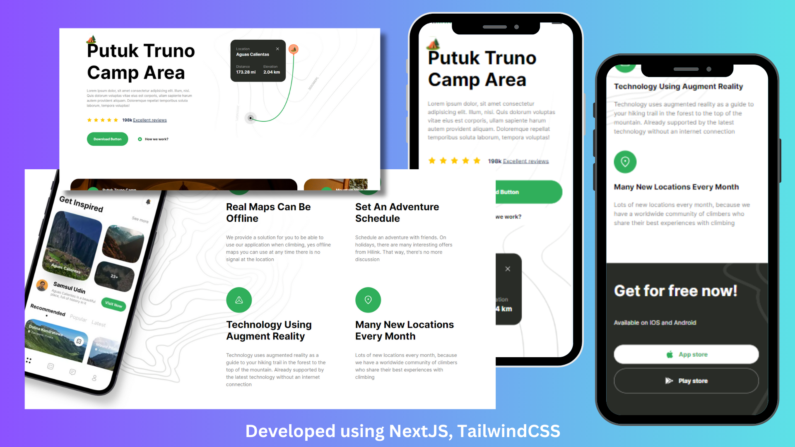

## Travel App Created using NextJS, TailWindCSS

Check out the project [NextJs Tailwind Travel HomePage](https://nextjs-travel-app-gray.vercel.app/) for more details.



## Local Setup

First, run the development server:

```bash
npm run dev
# or
yarn dev
# or
pnpm dev
# or
bun dev
```

Open [http://localhost:3000](http://localhost:3000) with your browser to see the result.

You can start editing the page by modifying `app/page.tsx`. The page auto-updates as you edit the file.
